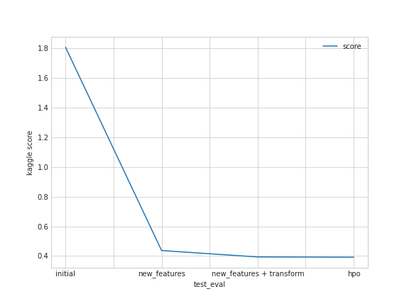

# Report: Predict Bike Sharing Demand with AutoGluon Solution
#### Savini M. Samarasinghe

## Initial Training
### What did you realize when you tried to submit your predictions? What changes were needed to the output of the predictor to submit your results?
* Looking at the summary statistics of the training data showed that the 'windspeed' and 'humidity' variables have minimum values of zero. A zero humidity is unrealistic.While a zero windspeed can indicate calm weather, it seems to be an unusual value, given that  windspeed can be reported at floating point precision. Therefore, I treated these zero values as missing data points. I used a K-nearest neighbor imputation method to fill out the missing values. 

* Also initial data visualizations showed a lot of similarity between the 'temp' and 'atemp' variables, which prompted to investigate the correlation coefficients between variables. The correlation  coeeficient between temp' and 'atemp' is very high (>0.98). Therefore, as a measure to avoid multicollinearity issues, the 'atemp' variable was eliminated from the input feature set. Here I decided to eliminate 'atemp' instead of 'temp' because 'temp' has a slightly higher correlation with the predictand ('count') variable. 

* Even after these adjustments, the trained model received a poor score on the Kaggle platform, suggesting room for improvement. This model had several limitations on how the input features were handled. Namely, several categorical features such as season and weather were treated as continuous integer variables. Also this model ignored the 'hour' variable which can be important to predict the demand for bike sharing, which is an activity that is dependent on the time of day.

### What was the top ranked model that performed?
* Initial model: WeightedEnsemble_L3 model
* New features: WeightedEnsemble_L3 model
* New features + log transformed predictand: WeightedEnsemble_L2 model
* New features + log transformed predictand + hpo: WeightedEnsemble_L2 model

## Exploratory data analysis and feature creation
### What did the exploratory analysis find and how did you add additional features?
In addition to the missing data and correlation related observations discussed in the previous section, an interesting observation is that the predictand 'count' variable is skew normal distributed. Given that we are using the rmse as the evaluation metric, it can make sense to transform the predictand variable or/and pay attention to the outliers/data in the tail end of the distribution. Here I utilized a log transform on the predictand data and that showed to improve the performance on the test data.

From the datetime variable, the year, month, day, hour, and day of the week (out of the 7 days) were extracted as separate input features. I encoded these variables as categorical variables as time is inherently cyclic.

### How much better did your model preform after adding additional features and why do you think that is?
The initial model received a kaggle score of 1.80822 on the test data. The next model that was trained after converting weather and season data into categorical variables and after including the hour information as an additional input feature scored 0.43710, resulting in a (1.80822-0.43710)*100/1.80822 =  75.83% improvement. In this model, the year, month, day, hour, and day of the week information was provided as categorical predictors.

When a categorical variable is represented numerically, e.g., as 1,2,3,..., the machine learning model will try to learn patterns that are related to the high/low numerical values of the variable. This is not meaningful (e.g., season 4 is not equal to season 1 multiplied by 4). Therefore it is important to use appropriate encoding to represent categorical variables.

The 'hour' variable can be thought of as an important feature to predict the demand for bike sharing, which is an activity that is dependent on the time of day.

After observing that the predictand 'count' variable is skew normal distributed, I carried out a log transform on it and used AutoGluon to find a new optimal model. This model gave a score of 0.39387, resulting in an (1.80822-0.39387)*100/1.80822 = 78.22% from the initial score.
  

## Hyper parameter tuning 
### How much better did your model preform after trying different hyper parameters?
Allowing to tune for hyperparameters improved the kaggle score to 0.39182, resulting in an improvement of (1.80822-0.39182)*100/1.80822 = 78.33% from the initial score.

### If you were given more time with this dataset, where do you think you would spend more time?
On feature engineering. I would spend more time to create features that are relevant to the problem using common/domain knowledge.

### Create a table with the models you ran, the hyperparameters modified, and the kaggle score.
|model|time_limit|searcher|predictand_log_transform|score|
|--|--|--|--|--|
|initial| 	10min 	|default 	|False 	|1.80822|
|new_features 	|10min 	|default 	|False 	|0.43710|
|new_features + transform 	|10min 	|default 	|True 	|0.39387|
|hpo 	|30min 	|bayes 	|True 	|0.39182|

### Create a line plot showing the top model score for the three (or more) training runs during the project.

### Create a line plot showing the top kaggle score for the three (or more) prediction submissions during the project.

## Summary
The results show that the different modifications improved the score on the test dataset. However, we see that the performance on the training dataset initially improves and then undergoes some small degradations. This can suggest that the models are improving their generalization capability by reducing overfitting to training data.

The results indicate that using a log transform on the predictand performs favorably on the test data and that running AutoGluon search for a longer time (30min) along with hyperparameter optimization also provide small performance boosts on the test data.
